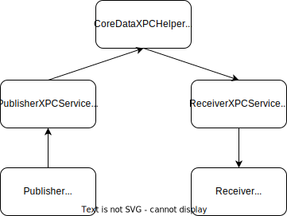
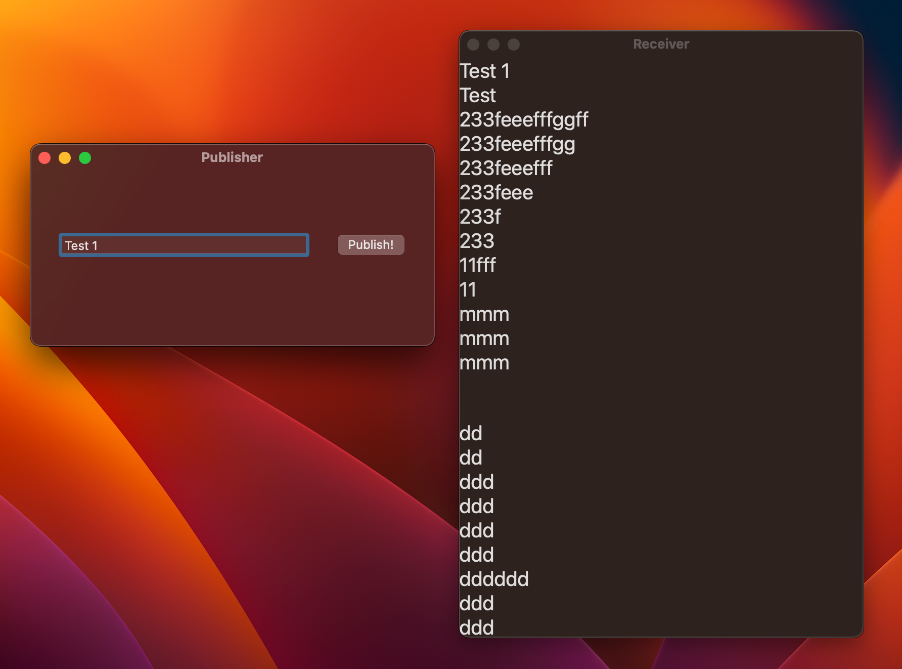

# CoreDataXPC

Core Data with XPC Mach Service on Cocoa

## References

- [[WWDC 2011] Introducing XPC](https://developer.apple.com/devcenter/download.action?path=/videos/wwdc_2011__hd/session_206__introducing_xpc.m4v)

- [[WWDC 2012] Cocoa Inter-process Communication with XPC](https://developer.apple.com/devcenter/download.action?path=/videos/wwdc_2012__hd/session_241__cocoa_interprocess_communication_with_xpc.mov)
